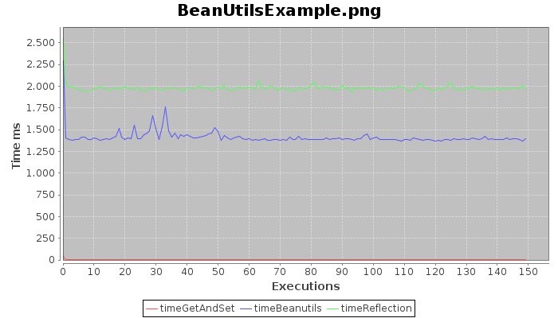
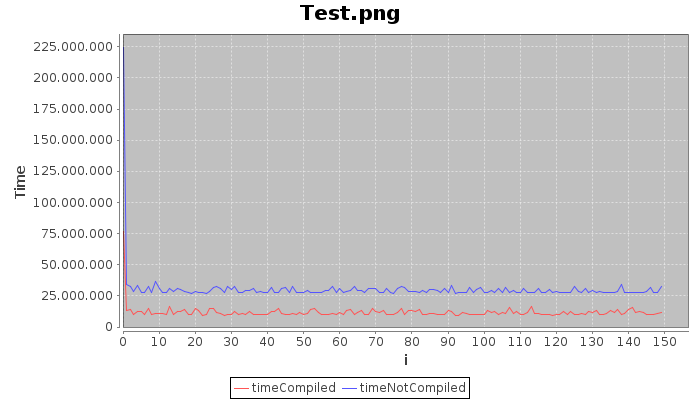

# benchmark
Simple java project to compare algorithm performance

## Compiling with Maven 

    mvn compile


    mvn package dependency:copy-dependencies


## Compiling with Gradle 


    gradle distZip


---

## Sample result

###  GetsetExample  
This is a pure java exemple accessing class fields

| Min      | AVG       | Max       | Variation |
|----------|-----------|-----------|-----------|
|      0ns |      3ms  |     63ms  |      3ms  |


### ReflectionExample  
The same funcionality using pure java reflection

| Min      | AVG       | Max       | Variation |
|----------|-----------|-----------|-----------|
|      7ms |     21ms  |    311ms  |     19ms  |

### BeanUtilsExample  
 The same example using the library Apache BenUtils

| Min      | AVG       | Max       | Variation |
|----------|-----------|-----------|-----------|
|      4ms |     50ms  |      2se  |     72ms  |



---
###  Regex Benchmark
A sample test with this regex string ```".*([\\d]+)"``` pre-compile and without compile: 



Note: This chart was generated withou this commit de16ba345a65b1fbdd433fe9c32e7862b25564ba by
@pslacerda . In this chart you can see the big difference by the first execution and the others.

## Using in you code


    <project>
      .
      .
      .
      <repositories>
        <repository>
          <id>github/edgardleal</id>
          <url>https://raw.github.com/edgardleal/benchmark/mvn-repo/</url>
          <snapshots>
            <enabled>true</enabled>
            <updatePolicy>always</updatePolicy>
          </snapshots>
        </repository>
      </repositories>
    
      <dependencies>
    
        <dependency>
          <groupId>com.edgardleal.benchmark</groupId>
          <artifactId>benchmark</artifactId>
          <version>1.0.1</version>
        </dependency>
      </dependencies>
    
    </project>


